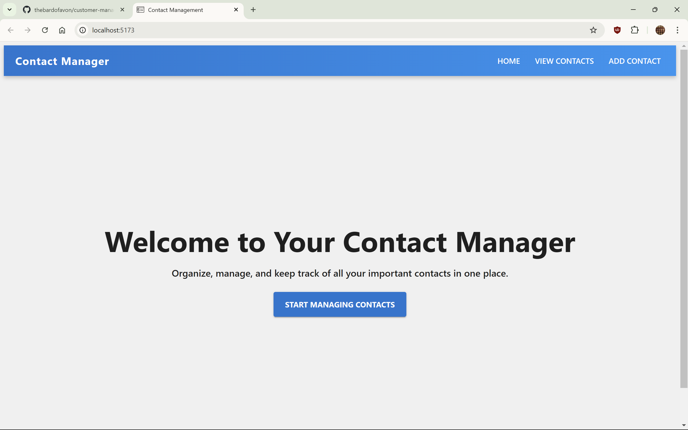
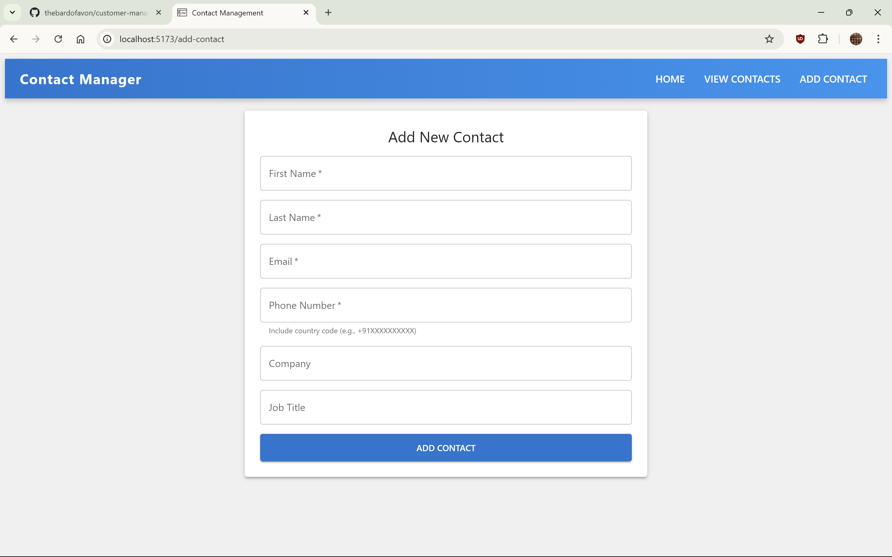
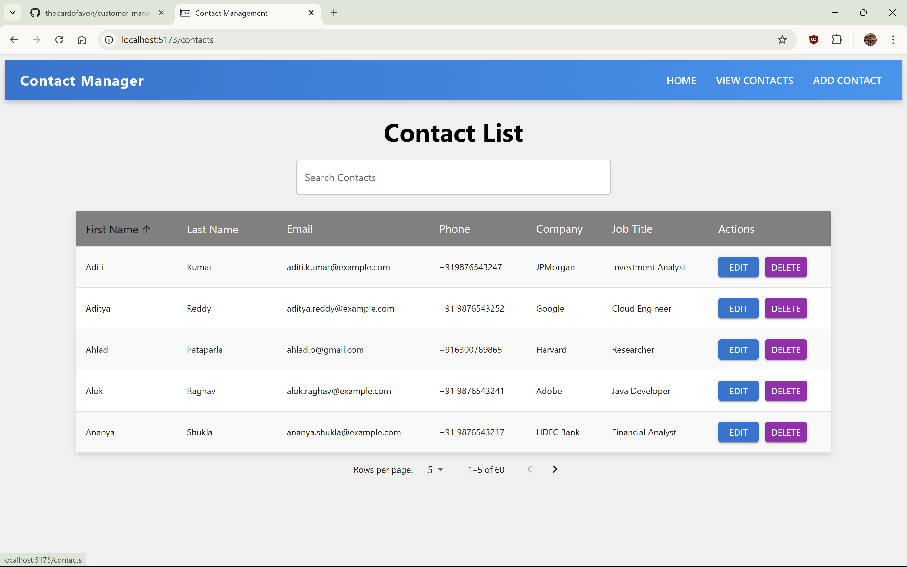
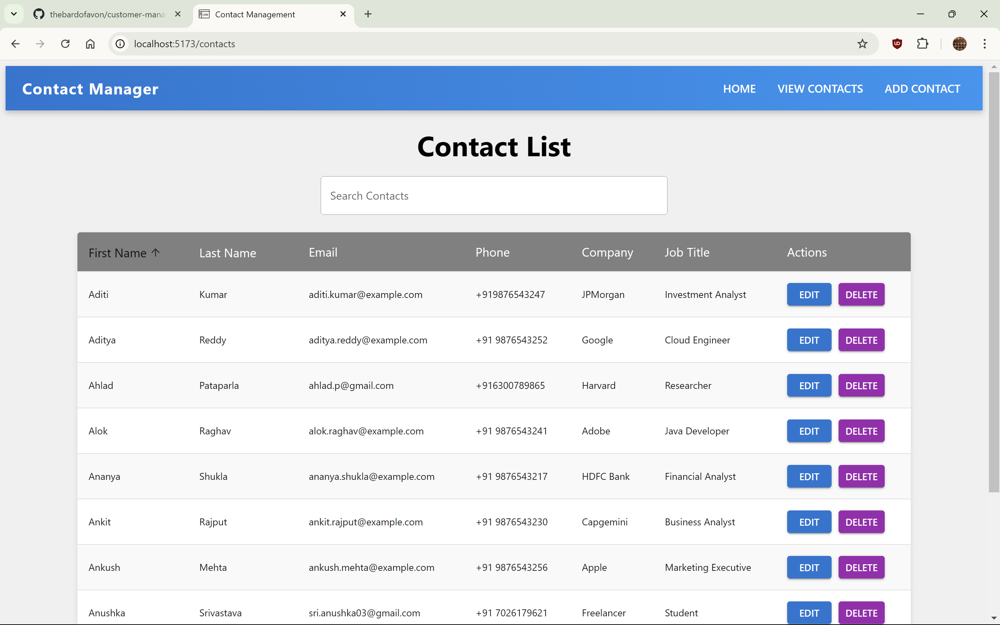
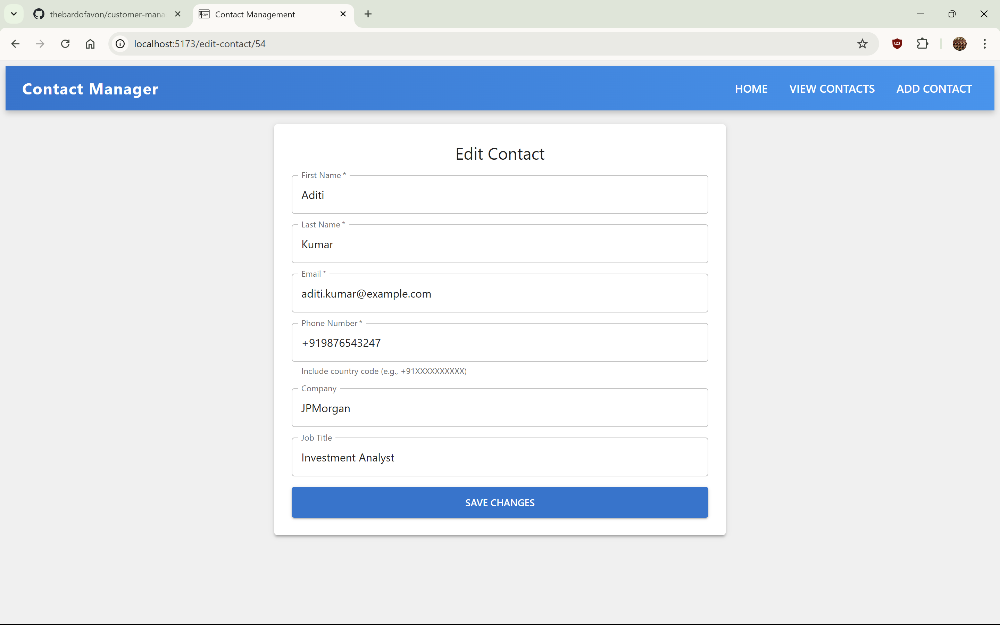

# Contact Management System

This project is a **Contact Management System** designed as a mini-feature for a CRM application. It allows users to manage contact details with essential CRUD operations such as creating, viewing, updating, and deleting contacts. 

The project uses a **ReactJS** frontend styled with **Material UI**, a **Node.js** backend for API services, and **MySQL** for database management. It includes robust input validation and error handling both on the frontend and backend.

<div style="display: flex; flex-wrap: wrap; justify-content: center; gap: 10px;">
  
  
  
  
  
</div>


## Features

- Add new contacts with fields for first name, last name, email, phone, company, and job title.
- Edit existing contact details.
- View a list of all contacts.
- Delete contacts from the list.
- Navigation bar for seamless routing between views.
- Input validation for email and phone number formats (including mandatory country code).
- Duplicate contact detection to prevent redundant entries.

---

## Technical Stack

### Frontend
- **ReactJS** with **Material UI**
- **Vite** for a fast development server
- **React Router** for client-side routing

### Backend
- **Node.js** with **Express.js**
- **MySQL** for database management
- **REST API** for communication between the frontend and backend

---

## Setup Instructions

Follow these steps to set up the project locally:

### Prerequisites

Ensure you have the following installed:
- [Node.js](https://nodejs.org/) (v14+)
- [MySQL](https://www.mysql.com/) database
- [Vite](https://vitejs.dev/)

### 1. Clone the Repository

```bash
git clone https://github.com/your-username/contact-management.git
cd contact-management
```

### 2. Install Dependencies

Frontend:
```bash
cd frontend
npm install
```
Backend:
```bash
cd backend
npm install
```
### 3. Configure the Database

i. Create a new MySQL database named contacts_db.
ii. Use the provided SQL script to set up the database schema:

```bash
CREATE DATABASE contacts_db;

USE contacts_db;

CREATE TABLE contacts (
    id INT AUTO_INCREMENT PRIMARY KEY,
    first_name VARCHAR(50) NOT NULL,
    last_name VARCHAR(50) NOT NULL,
    email VARCHAR(100) NOT NULL,
    phone VARCHAR(15) NOT NULL,
    company VARCHAR(100),
    job_title VARCHAR(100)
);
```
iii. Create a .env file and update the database connection details in the dotenv file as follows:

```bash
DB_HOST=localhost
DB_USER=your_username
DB_PASS=your_password
DB_NAME=contacts_db
PORT=your_port
```
iv. Start the Application

#### Backend:
```bash
cd backend
node index.js
```

#### Frontend:

```bash
cd frontend
npm run dev
```

Access the application at http://localhost:5173 or wherever it prompts you to.

# Contact Management System

## How It Works

### Frontend

- **Add Contact**:  
  Form with validation to ensure proper email format and a phone number with a country code.

- **Edit Contact**:  
  Pre-populated form for editing, with validation and duplicate detection.

- **View Contacts**:  
  List of all contacts retrieved via the backend API.

- **Delete Contact**:  
  Removes the contact and refreshes the view.

### Backend

- **Create Contact**:  
  - Validates input fields (email, phone).  
  - Checks for duplicates before insertion.

- **Update Contact**:  
  - Ensures no duplicates for updated records.  
  - Updates data in the database.

- **Delete Contact**:  
  Removes the contact by its ID.

- **Get Contacts**:  
  Fetches all records from the database.

- **Get Contact by ID**:  
  Retrieves details for a specific contact.

---

## Challenges and Solutions

1. **Validating Phone Numbers and Emails**  
   - **Challenge**: Enforcing phone numbers to include a valid country code and validating email format.  
   - **Solution**: Used regex patterns both in the frontend and backend to validate these inputs.

2. **Handling Duplicate Entries**  
   - **Challenge**: Prevent duplicate email addresses or phone numbers from being added or updated.  
   - **Solution**: Implemented duplicate checks in the backend API using SQL queries.

3. **Error Messaging**  
   - **Challenge**: Providing clear error messages to users.  
   - **Solution**: Implemented detailed error handling in both frontend and backend, with appropriate messages displayed on the UI.

4. **Frontend and Backend Synchronization**  
   - **Challenge**: Ensuring consistent validation across frontend and backend.  
   - **Solution**: Shared validation logic and tested API responses thoroughly to maintain uniform behavior.

---

## Future Improvements

- Add authentication for secure access.  
- Implement advanced search and filtering for contacts.  
- Deploy the app to a cloud platform.

---

## Author

Created by **Anushka Srivastava** as a part of a CRM mini-feature assignment.


